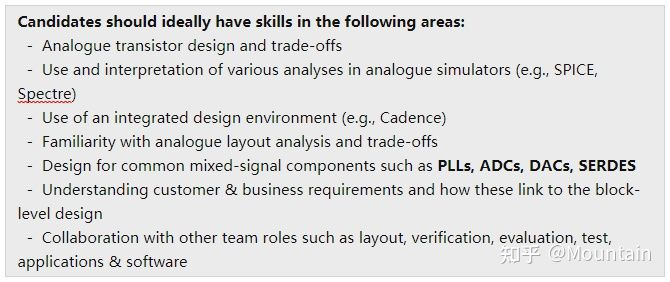
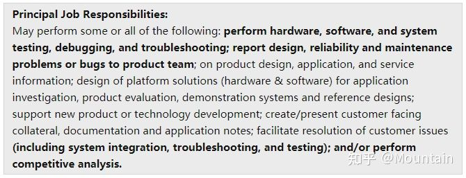

# 关于模拟集成电路(Analog IC)设计的一些心得 - 10/13/2021 更新


> 原载于知乎专栏“[*通向模拟集成电路设计师之路*](https://zhuanlan.zhihu.com/p/54734023)”，后因文章编辑需频繁绑定/解绑+86手机号，故迁移至此。
[-联系作者-](mailto:valiant.soil-0s@icloud.com)
 
**未经授权，请勿转载**

---
> 更新部分：
> - Tips·关于论文投稿
---

## 目录

- 前言
- Tips·学习
- Tips·设计
- Tips·关于论文投稿
- Tips·关于就业
- Tools/实用网址
- 附录

## 前言
* 虽然很希望能有更多的人进入模拟IC行业，但是跟其他很多工程类专业相比，模拟IC更像是一个**慢工出细活**的手艺行当，投入产出比 较高、岗位开放也少（去任何一个硬件公司的career下都会发现，即便是本身岗位就很少的芯片设计，仍然是“数字/后端>>模拟前端”）。所以**不太适合想要快速获得稳定且高薪工作的求职者**。但是作为"与真实世界的接口"，工业界对于模拟IC的需求一直都在，且最tricky的一点是：年轻人很难干得过业界的老人。所以，关键点无非在于年轻人能不能“进入这个高壁垒的产业”并“幸存下来”罢了——而对于这把双刃剑如何使用，完全取决于自己。

> 没想到距离上一次更新已经过了两年，平时其实也有不少想法，奈何知乎两年前开始要求绑定大陆手机号，便搁置了下来。19~20年间自己也经历了找实习、实习、期刊论文种种转折，如今自己的PhD不觉也已过大半。看着身边的师弟师妹找工作，交流之余想起自己曾经也写过的这些“心得文字”，也是时候跟进一下了。不敢说自己是过来人——analog/ RF IC行业藏龙卧虎，万不敢班门弄斧——只当是给自己的博士生涯留下些印记吧!


## Tips · 学习

* 无论何时何地，模电的内容都是一样的难、文献也是一样的多；学习领悟的效率往往取决于是否真的“书到用时”，然而与其临时抱佛脚，不如平时多积累。
* 模电的学习远远**不止“背公式”那么简单**（当然那些公式也没有那么好背…），理解电路才是最重要的：

> 模电的试题可以出得非常难，但是对于本科（甚至研究生）的考试而言，通常都是对于一些经典结构的变形而已——否则学生规定时间内一定做不完、老师和助教判卷子也会非常艰难——所以，模电应试也是**可以“刷题”的**，但不同点是**一定要理解那些公式是怎么来的、怎么用的、完整/简化的模型对应的条件是什么**，否则考试的时候一定会傻眼，但并不是因为题有多难。
> 如果学院不是每年都出老题改个数就行的话，一周速成模电是不存在的，工夫要下在平时。

* 做IC设计如果英文过得去就**不要看中文教材**了，大多数中文教材翻译很别扭，电路原理>英文描述>中文翻译>理解中文>恢复电路原理，“级联系统”数越多，“噪声指数”越大。
* **完整地做一个项目**（schematic->layout->PCB + on-the-bench measurement）比上三门“硬”课所学的东西要多。课上了可以忘，而做项目会让你不得不将所需要的知识刻入脑海。

## Tips · 设计

* **版图不美观的设计多半有缺陷**，state of the art的颜值一定是同时期内最能打的。

* **画电路时画得美观一点**，专业的电路设计应结构清晰、连线简洁，不是为了好看，而是在面对逐渐扩充的电路系统时，设计师能够高效快速地定位及进行修改。

  > 对比一下Cadence根据verilog-a代码自己生成电路图及版图就知道了。
  > 以上仅针对模拟及射频IC，VLSI设计则另当别论。

* 大胆的**trial-and-error**很重要，但是没有**理论的指导**往往会走数十倍的弯路；然而不跑足够多的仿真、画足够多的版图，越是高屋建瓴的理论也越容易纸上谈兵

* Everything has its price，没有完美的解决方案，只有**利益最大化**的妥协

* 电路设计与仿真的过程中往往会遇到千奇百怪的问题，各大电子论坛也许有类似的解决方法、也许没有，最有效的往往是：1. 查阅仿真软件的Help页 > 2. 阅读仿真软件user manual > 3. 阅读设计套件(Design kit)的reference > 4. trial-and-error

* 仿真设计中“*控制变量法*”很重要。每一次仿真一定要有计划地进行，否则容易重蹈覆辙——修改什么变量、保留什么setup最好要有笔记记录。

* 关于**实验日志记录**，优先度：电子版>>纸质版。每一次实验开始及完成记得绘制流程图或思维导图，标记好仿真开始时间、仿真数据存储位置、setup、预期完成时间等等。**PDF格式为首选**，任何平台打开都不会出现乱码。
  
  > 在此推荐 OneNote（如果有iPad和pencil的话会更加顺手），最大的好处是可以不限纸张大小进行绘图，且可以插入多种格式的附件（**强烈推荐**）。用公司/学校账户进行云端同步之后也方便随时预览展示——思维导图、与做笔记神器！（虽然感觉各种云服务相关软件国内用起来都有点蛋疼）
  >
  > > 纸质版笔记写过一年，用了三个笔记本，写到第二个本子的时候已经忘了实验最初阶段的测试方案，查阅极不方便、不能插图片（以至于电路结构每次都要重新画，导致不想记笔记）、不便携带且浪费纸。
  
* **尽早开始考虑Layout(版图)设计**，跑仿真的同时看看自己的设计的面积是否合理、晶体管的大小、形状、multiplicity、能否高效布线等等，否则后期布线会非常艰难，即便有专门的layout设计师，也可能增加出错的风险，来回沟通耽误流片。

* 如果考虑流片的话，**mismatch与process variations**(PV)对于设计的影响一定要尽早考虑，Monte Carlo(mismatch/PV)和corner(fab/temperature, etc)仿真一定要认真分析，时间充裕的话前仿和后仿都要跑，结合layout设计反复修改以达到最优值。

  > 有不少文献中会提到"20%～40% of PV"，通常情况下指的是对于某项特定参数的parametric sweep（如MOSFET的阈值电压Vth）且往往针对数字系统——而非ADE XL中的MC仿真。对于模拟电路而言，为保证流片的可靠性，最好**使用foundry提供的完整模型**，而不是简单的SPICE模型。
> [关于Monte Carlo的介绍可供参考](http://miscircuitos.com/monte-carlo-simulation-cadence-virtuoso/)

* **RF IC和Analo IC在layout design中应当区别对待**，对于一般的opamp、OTA，甚至中低频的AD/DA电路，layout设计所造成的performance degradation并不会太明显，但对于RF IC而言，往往光layout就可以花上两三个月进行设计，且前仿和后仿差别可能会非常大

  > 这其实取决于具体的design  kit，比如学校里常用的gpdk180，做做普通的opamp还行，RF电路基本后仿就没有几个正常工作的。之前组里的大牛同事还专门研究过，发现问题主要在于layout extraction（QRC），除了ind参数有bug以外，寄生电阻过高也可能导致莫名其妙的问题（LNA不稳定或VCO不起振等等）

- 在Cadence Virtuoso (以IC615为例) 中跑Monte Carlo  Simulation时如果中途报错或者直接crash掉之后，可以到Data  ViewHistory>MonteCarlo.xx>右键>Re-run Unfinished/Error  Points，而不需要重新开始，非常方便。（注意匹配先前的文件/数据存储路径）
- Cadence每隔一段时间最好重启一次（尤其是在跑长时间仿真之前），曾经遇到过“同一电路，同一test bench，同一setup，同一server，结果就是不一样”的情况，重启之后瞬间恢复正常，但是没人知道为啥…

（待续）

## Tips · 关于paper

（来自于数次review中发现的问题）：

**Conf.和Trans./J.的审稿流程略有区别**

- **Conf.**通常情况下各个AE将收到的论文分发给自己的**研究生**（每篇论文reviewer 3~5名），review的内容和周期相对而言都z比较简短（通常一个月之内便final），**但是——会议论文是没有argue/rebut环节的**，各个reviewer基于自己的判断给出accept，marginally  accept/reject，reject之后便结束评审，而author收到review之后也只是进行论文修改/补充，不存在"纠正reviewer"。所以虽然会议论文短小精悍、命中率也相对高，但如果初稿论文逻辑不够清晰的话就容易gg。
- **Trans./J呢周期就比较长**了，从投稿到第一次feedback一般在一个月左右（如果赶上某个reviewer太忙忘了回复等等，甚至可能会等两到三个月），reviewer一般由期刊的EIC/AE直接发给系统内“**有review资历”的博士、教授、业界senior designer**，故review的内容相对更加详实和harsh，往年一篇论文可能会经历submit->major revision->minor revision->accept/reject四个阶段（至少三个月），*近年来以TCAS-I为例，期刊有缩短评审周期的倾向*，即省略minor的步骤——这就意味着第一轮后的**major revision及response将会非常重要**。一般来说，收到comment都会比较negative，所以argue的内容切忌太过offensive。response一方面是给reviewer的回复，另一方面是给EIC/AE的澄清，讲理论、摆数据，make improvement and conclusion。除非你的老板是该期刊的AE或者IEEE Fellow，硬杠基本上没什么好下场。
- **Conf.一般情况下是double-blind review，即作者和reviewer的身份信息完全隐去。Trans./ J. 通常作者信息对reviewer可见（反之则不是）**。虽然作为学者很多时候我们都expect everyone to be professional，但是不论是期刊还是会议，**很多时候reviewer未必都能做到客观公正 就事论事**（objective）——这就意味着你的cover letter也好、rebuttal  letter和response也好，都是一个比较tricky的过程，尊重自己成果的同时也请尊重EIC/AE以及那些非常mean的reviewer，不卑不亢好过上来就和看不见的reviwer battle

> 当一个外领域的reviewer拿到你的论文，同样是看不懂实验方法，A: “the reviewer is confused by xxx”和  B:“This paper doesn't make any sense / is  meaningless”造成的damage是完全不同的。所以，请牢记并非所有reviewer都是敌人，要做的是争取到多数reviewer站在你这一边，而不是逞口舌之快而得罪所有人、甚至把A变成B。

**其他建议**

1. 避免无目标海投——**每篇论文在投稿时要有针对性**，应对目标期刊进行量身定制(topic, intro, reference)，“use their language”，而不是从一开始便照着要多投不同刊物的目的来撰写。**即便是被A拒稿决定另投期刊B，一定要大改确保内容符合B的主题。** *e.g. 被TMTT拒稿的论文如果直接改投TCAS-I，十有八九连EIC/AE那一关都过不了，原因是不符合TCAS-I的subject，建议改投TMTT等等*

2. **不要文不对题**，文章主要内容和数据结果要和标题要契合，跑题基本上是一票否决的；

3. **不要耍小聪明**，该包含的FoM、specs最好都列出来，比如对于filter主题的文章，就一定要包含frequency response,  linearity；放大器、LNA除了gain、BW以外，power也是评审关心的（基本上八边形法则或多或少都要提到，否则应给出强有力的解释）；

4. **不要回避tradeoff**，文章与项目中的weakness可以在Future Works或者Discussion里进行补充说明，但是如果全文只字未提（而被本专业的reviewer捕捉到了的话），基本上就会被认定在该方面“有重大缺陷”；

5. 语法、拼写、**论文格式**（字体、字号、公式格式等等）、插图标题、段首缩进、cross-reference是否正确统一等等，虽说都是小问题，但是如果累积超过一定程度（取决于reviewer**主观感受**），就容易被冠上“low quality”打回去；不要让reviewer来帮你修改病句、格式等等（**1、降低了印象分，2、分散了关注重点，3、降低了reviewer对论文不严谨的容忍度**）

   > 关于语法问题：可以用grammarly进行第一步查错，之后可以用google translate将自己写的英文翻译成中文，看看能不能读得通——读不通的话多半是逻辑表达有问题——屡试不爽（**不要用中文写论文之后用机器翻译成英文**！小心查重）

6. 原理图、电路图要用**专业绘图软件**进行绘制（如visio），且全文绘图风格要统一（针对多名作者）；

7. **MATLAB**作图在工程类论文中很受欢迎，通常被认为“从一定程度上反映了作者的科研水平”；

8. 通常，会议论文评审中同一篇论文会有五到六位reviewers进行评阅，评阅后的反馈有两部分：1、对论文作者；2、给会议主办方（这一部分论文作者不可见：所以整体印象真的很重要）。

9. Reviewers**不一定**来自于你所在的领域，所以运用专业术语缩写之前至少有一个全称，同时撰写文章的语言尽量简练，超过五行的句子看起来会非常难理解。
10. LaTeX 方便自己、word方便导师，刚开始的时候觉得看到LaTeX代码头都大，到后来才发现一旦模板搞好了真是香，文献增删以及交叉引用不要太爽。

（待续）

## Tips · 关于就业

> 芯片方向准备走*学界* 的同志们，这篇文字对你大概就没什么帮助了XD

首先需要点明的是，半导体专业Ph.D.的从业方向，是万万不敢随意置评的——毕竟自己也是个半调子，何时毕业、将去何方也未有定数。观察到的呢，身边读到博士的师兄师姐、同事同学，大多去了*业界*，而狠下心进站读博后再慢慢从AP熬到tenure可谓寥寥：可能还是*学界* 对于天赋和眼界的要求着实太高吧——即便跟了导师四五年，也曾数次被劝导让考虑一下faculty position，自己仍然觉得距离prof的水准隔了一道天堑。

回到正题。如果在EE大类下选了analog/RF IC、坚持下来没有中途转码并且对于自己的学业/  research仍抱有兴趣的话，相信很多同学都会/面临过“要不要继续读个博？”这个问题。立志当prof走教职的自然不必说，一条路往上走就是了——而大多数人可能在MS/Ph.D.初期，大概都是奔着industry大厂去的。

就个人找实习的经历和感受而言，**Ph.D.对口的岗位大多偏向设计（Design engineer）**且分类非常细致，analog方向的OPAMP、OTA、BGR、LDO、Baseband  Filter；RF方向的LNA、mixer、filter、PA、switch；mixed-signal的ADC、DAC、comparator、S/H、PLL、CLK gen；等等，**这些关键词往往在job description里都会有重点标明**——而不是electrical engineering或circuit design/analysis之类的统称。而工作内容大多为**片级（on-chip）**设计及测试，以及相关的**layout design**和**post-layout simulation**，以及与lab沟通制定流片后的test plan等等：



另一方面，对于**MS毕业生**而言，如果在校期间以授课为主（course-only）或者未经历过流片、测试的流程，一般在求职时会偏向更宽泛的岗位，如应用/产品工程师（Application/ Product Engineer,  注：此app非彼App）。通常而言，MS求职者相对于Ph.D.而言选择更灵活、岗位数量相对也多。工作内容多为**板级（on-board/PCB）设计或测试**，面向的不再是Cadence，而是PSPICE/LTSPICE等等。所以可能会经常接触成品芯片、封装好的opamp、driver、buffer、各类电容、电感、电位器、变压器等等；同时因为需要与各个部门的designer沟通，多数情况下也需要单片机、verilog甚至MATLAB的基础知识。**概括来说就是不需要太深入、大概都懂一点最好**。因此，求职时的job descriptions的要求也会写的相对笼统、宽泛一些：



**需要指出的是，analog/RF行业的岗位并没有高低好坏、只有是否适合**。MS如果PCB玩得溜、想要尽快就业积累经验，application/product engineer毫无疑问就是首选；如果你有相当的design及流片经验、且偏好原创性稍强的工作内容，那么各类design  engineer就是你的dream position——这与Ph.D.相比选择就更为灵活了，毕竟公司大概也不会高价聘一个博士回来做测试对不对？

（待续）

## Tools · 实用网址

- [阻抗匹配计算器](https://home.sandiego.edu/~ekim/e194rfs01/jwmatcher/matcher2.html)，用于down/up conversion network参数计算非常方便
- [ADI官网计算器](https://www.analog.com/en/design-center/interactive-design-tools/rf-impedance-matching-calculator.html)以供参考
- 还是[关于传输线阻抗匹配计算及转换的网站 - 1](http://wcalc.sourceforge.net/about.html)
- 还是[关于传输线阻抗匹配计算及转换的网站 - 2](https://www.eeweb.com/tools/pi-match/)
- [关于Cadence Virtuoso的一点使用技巧](https://wikis.ece.iastate.edu/vlsi/index.php/Tips_%26_Tricks)，可以修改仿真界面的默认设置（背景色黑转白、marker字体大小等等）
- [英文版工具书，包含了不少基础电路设计所需要的知识点，方便设计时随时查找](https://www.electronics-tutorials.ws/)
- 良心论坛 [EETOP](http://bbs.eetop.cn/)，可以找到不少电子版的中英文教材，至于学术探讨什么的见仁见智吧

* [RF系统设计参数计算工具网站](https://www.everythingrf.com/rf-calculators)

* 非常好用的[数学计算器](https://www.mathway.com/Algebra)，包括了多项式展开等等（可用于估算HD3,IIP3,1dB compression point之类）

* 一些修改Cadence Virtuoso仿真结果界面参数的快捷指令

  ```
  envSetVal("viva.rectGraph" "background" 'string "white")
  envSetVal("viva.trace" "lineThickness" 'string "thick")
  envSetVal("viva.graph" "titleFont" 'string "Times,14,-1,5,55,0,0,0,0,0")
  envSetVal("viva.axis" "font" 'string "Times,14,-1,5,50,0,0,0,0,0")
  envSetVal("viva.horizMarker" "font" 'string "Times,14,-1,5,50,0,0,0,0,0")
  envSetVal("viva.referenceLineMarker" "font" 'string "Times,8,-1,5,55,0,0,0,0,0")
  envSetVal("viva.vertMarker" "font" 'string "Times,14,-1,5,50,0,0,0,0,0")
  envSetVal("viva.pointMarker" "font" 'string "Times,14,-1,5,50,0,0,0,0,0")
  envSetVal("viva.refPointMarker" "font" 'string "Times,14,-1,5,50,0,0,0,0,0")
  envSetVal("viva.specMarker" "font" 'string "Times,14,-1,5,50,0,0,0,0,0")
  envSetVal("viva.interceptMarker" "font" 'string "Times,14,-1,5,50,0,0,0,0,0")
  envSetVal("viva.circleMarker" "font" 'string "Times,14,-1,5,50,0,0,0,0,0")
  envSetVal("viva.multiDeltaMarker" "font" 'string "Times,14,-1,5,50,0,0,0,0,0")
  envSetVal("viva.transEdgeMarker" "font" 'string "Times,14,-1,5,50,0,0,0,0,0")
  envSetVal("viva.graphLabel" "font" 'string "Times,14,-1,5,50,0,0,0,0,0")
  envSetVal("viva.polarGrid" "font" 'string "Times,14,-1,5,50,0,0,0,0,0")
  envSetVal("viva.smithGrid" "font" 'string "Times,14,-1,5,50,0,0,0,0,0")
  ```

## 附录

一个可供参考的[求职简历模板](https://ocs.fas.harvard.edu/files/ocs/files/phd_resume_cover_letters.pdf)（Ph.D. MS均适用）
